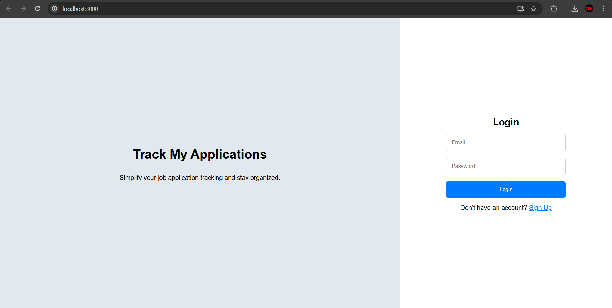
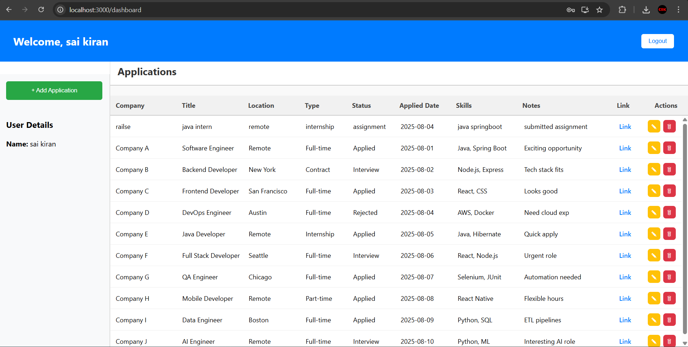

#  Job Application Tracker

**Job Application Tracker** — a RESTful Spring Boot application that helps users manage and track their job applications securely using JWT-based authentication.

---

##  Features

### Backend (Spring Boot)
- RESTful APIs for job application management
- JWT-based authentication and authorization
- User registration & login
- CRUD operations for job applications
- CORS configuration for frontend-backend integration

### Frontend
- Built with HTML, CSS, and JavaScript
- Responsive and clean UI design
- Dynamic dashboard to view and manage applications
- Integrated with backend via REST APIs

---

## 🛠️ Tech Stack

**Backend:** Java, Spring Boot, Spring Security, JWT, MySQL  
**Frontend:** HTML, CSS, JavaScript  
**Database:** MySQL

---

## ⚙️ Setup & Installation

## Clone the repo
```bash
# Clone the repository
git clone https://github.com/KiranChaitanya463/TrackMyApplications
```

### Backend 
```bash
# Open in your IDE (e.g., IntelliJ IDEA or Eclipse)

# Update `application.properties` with your database credentials

# Run the Spring Boot application
mvn spring-boot:run
```

### Frontend
```bash
# Run the react
npm start

```

---

## ▶️ How to Run
1. Start the **backend** (Spring Boot server).
2. Open the **frontend** in your browser.
3. Register a new account or log in.
4. Start adding and tracking your job applications.

---

## 📸 Screenshots

### Login Page


### Dashboard

